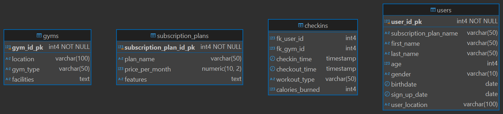
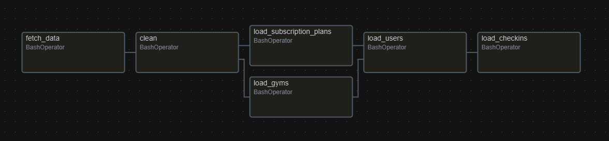

# Data Engineering on a Budget: Embracing On-Premise Solutions for OLTP & OLAP

In today’s evolving IT landscape, data engineering is crucial for managing and analyzing data effectively. While cloud solutions are popular, you don’t have to jump to the cloud to modernize your data infrastructure. This post explores a low-cost, on-premise approach to transitioning from flat files to databases, using OLTP and OLAP systems to handle both transactional and analytical needs efficiently.

### The On-Premise Advantage

On-premise data solutions offer several benefits, especially for small and medium-sized businesses looking to modernize legacy data stores without overextending budgets and skill sets. By leveraging existing infrastructure, organizations can avoid the significant expenses associated with moving to the cloud, which is particularly beneficial for those with extensive legacy systems.

### Flat File to Database: Best Practices

When dealing with flat files, it's crucial to follow best practices to ensure a smooth transition to a database system. This includes using a consistent delimiter, cleaning data before import, and using descriptive column headers to maintain data quality and consistency. Integrating external data sources with SQL databases requires a deep understanding of data extraction, transformation, and loading processes, which are essential for building a robust data integration pipeline.

### OLTP vs. OLAP

Understanding the difference between OLTP and OLAP databases is key to supporting various business needs. OLTP systems are designed for fast, transactional processing, handling high volumes of read and write operations in real-time. In contrast, OLAP databases are optimized for complex queries and data analysis, focusing on read-intensive operations. This distinction is crucial for data engineers as they design systems to handle different types of data workloads.

### Conclusion

For IT professionals looking to transition into data engineering roles, embracing on-premise solutions can be a cost-effective way to develop and demonstrate their skills. By understanding the nuances of data processing systems and adhering to best practices, they can build efficient and scalable data solutions that cater to the specific needs of businesses today.

## TODO
- Identify dataset.
- Identify Key Performance Indicators (KPIs).
- Create data models.
- Load data models.

## Files
Please note that .ipynb files may not display consistently on GitHub. It is advisable to utilize nbviewer for a more reliable viewing experience of these documents.

- README.md
- gym_explore.ipynb
- data/checkin_checkout_history_updated.csv
- data/gym_locations_data.csv
- data/subscription_plans.csv
- data/users_data.csv
- images/csv_oltp.png
- images/csv_snow.png
- images/csv_star.png
- kpis/kpi_02.ipynb

## Dataset
- [Gym Check-ins and User Metadata](https://www.kaggle.com/datasets/mexwell/gym-check-ins-and-user-metadata)

This pristine dataset is the perfect foundation for this project. As a fitness enthusiast, I can't wait to dive in and have a blast analyzing this data. Let's turn those check-ins into insights! 💪📊

## Key Performance Indicators (KPIs):
These measurable values help organizations track their progress toward achieving key business objectives. Essentially, KPIs serve as a performance management tool that provides a focus for strategic and operational improvement and creates an analytical basis for decision-making.

In this dataset, we'll find key indicators that help gym owners and managers understand member behavior, streamline gym operations, and make informed decisions to enhance the overall gym experience.  Here are some potential KPIs:

1. **Check-In Rate**: The percentage of active members who check in during a specific period. This helps gauge member engagement and gym usage.
2. **Peak Hours**: Identifying the busiest times of the day or week can help with staffing and resource allocation.
3. **Average Check-Ins Per Member**: The average number of times a member checks in during a month. This can indicate member engagement and satisfaction.
4. **New Member Check-In Rate**: The frequency at which new members check in during their first month. This can help assess the onboarding process.
5. **Inactive Member Rate**: The percentage of members who haven't checked in for a certain period (e.g., 30 days). This can help identify members at risk of canceling their memberships.
6. **Retention Rate**: The percentage of members who continue to check in regularly over time. This is crucial for understanding member loyalty.
7. **Churn Rate**: The percentage of members who stop checking in and eventually cancel their memberships. This helps identify potential issues with member satisfaction.
8. **Class Attendance Rate**: For gyms offering classes, tracking the attendance rate can help understand the popularity and effectiveness of different classes.
9. **Equipment Usage Rate**: Monitoring how often specific equipment is used can help with maintenance schedules and purchasing decisions.
10. **Member Feedback**: Collecting and analyzing feedback from members about their check-in experience can provide insights into areas for improvement.

## Data Models
OLTP defined schema.

OLAP Star defined schema.
 

OLAP Snowflake defined schema.
 

## Populate Models
Data models can be efficiently loaded through the use of bulk load applications. However, when the schema undergoes transformation and no longer aligns with the original CSV file formats, a programmatic approach may be necessary. This article will delve into the diverse methods available for accomplishing this task.

## Final Thoughts
The unavailability of updates for the dataset in this project presents a challenge to the expansion of our data warehouse. Should updates become available, we could enhance our tables by employing a systematic approach to data population. Apache Airflow provides a framework to design and orchestrate such workflows.   With our goal in mind, we can emulate these processes through database jobs. Contemporary databases offer features for scheduling and executing code, with Postgres' pgAgent being a prime example. While it may lack the finesse of Airflow, each task in Airflow could be translated into a discrete job within the database, ensuring a functional, if not as streamlined, workflow.
